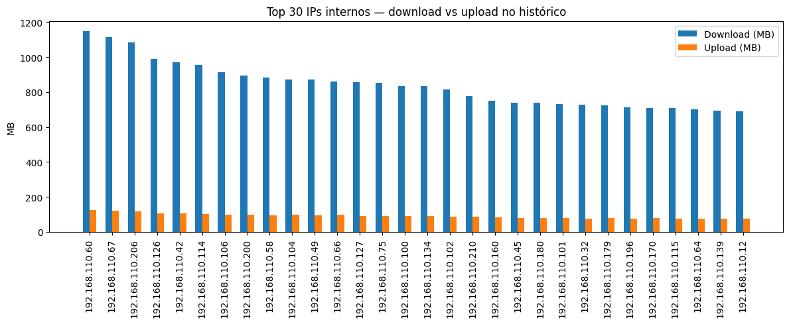
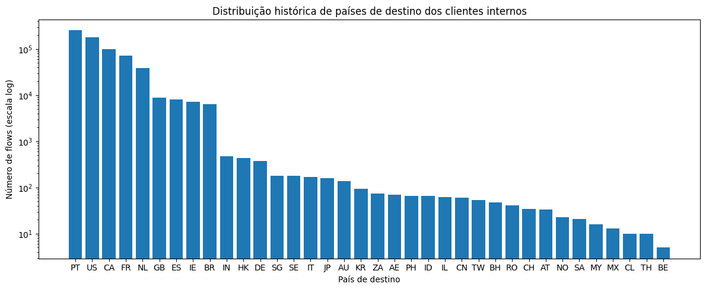
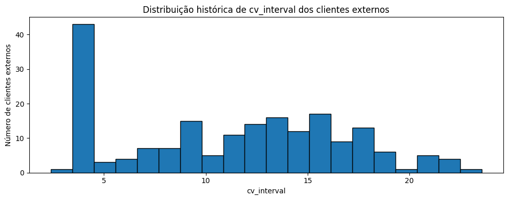
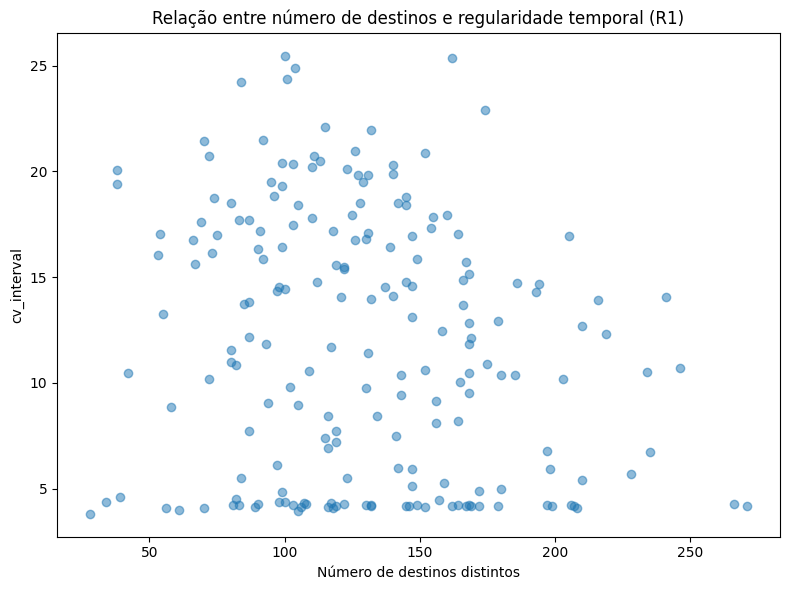

# UEBA Module for SIEM — Network Anomaly Detection

## Autores

| Nome | Número |
|------|--------|
| Ruben Lopes | 103009 |
| Lucas Rebelo | 123934 |

---

## Índice

1. [Introdução](#introdução)
2. [Objetivo](#objetivo)
3. [Metodologia e dados utilizados](#metodologia-e-dados-utilizados)
4. [Section 1 — Análise do comportamento não anómalo](#section-1--análise-do-comportamento-não-anómalo)
   - 4.1. [Redes privadas identificadas](#41-redes-privadas-identificadas)
   - 4.2. [Servidores e serviços internos identificados](#42-servidores-e-serviços-internos-identificados)
   - 4.3. [Estatísticas de tráfego dos utilizadores internos](#43-estatísticas-de-tráfego-dos-utilizadores-internos)
   - 4.4. [Estatísticas de tráfego dos utilizadores externos](#44-estatísticas-de-tráfego-dos-utilizadores-externos)
5. [Section 2 — Definição e justificação das regras UEBA](#section-2--definição-e-justificação-das-regras-ueba)
   - 5.1. [Regra R1 — Deteção de atividade BotNet interna](#51-regra-r1--deteção-de-atividade-botnet-interna)
   - 5.2. [Regra R2 — Deteção de exfiltração de dados via HTTPS](#52-regra-r2--deteção-de-exfiltração-de-dados-via-https)
   - 5.3. [Regra R3 — Deteção de exfiltração de dados via DNS](#53-regra-r3--deteção-de-exfiltração-de-dados-via-dns)
   - 5.4. [Regra R4 — Deteção de atividades de C&C via DNS](#54-regra-r4--deteção-de-atividades-de-cc-via-dns)
   - 5.5. [Regra R5 — Deteção de destinos externos anómalos](#55-regra-r5--deteção-de-destinos-externos-anómalos)
   - 5.6. [Regra R6 — Deteção de utilizadores externos com comportamento anómalo](#56-regra-r6--deteção-de-utilizadores-externos-com-comportamento-anómalo)
6. [Section 3 — Resultados dos testes das regras UEBA](#section-3--resultados-dos-testes-das-regras-ueba)
   - 6.1. [R1 — BotNet interna](#61-r1--botnet-interna)
   - 6.2. [R2 — Exfiltração via HTTPS](#62-r2--exfiltração-via-https)
   - 6.3. [R3 — Exfiltração via DNS](#63-r3--exfiltração-via-dns)
   - 6.4. [R4 — C&C via DNS](#64-r4--cc-via-dns)
   - 6.5. [R5 — Destinos externos anómalos](#65-r5--destinos-externos-anómalos)
   - 6.6. [R6 — Clientes externos anómalos](#66-r6--clientes-externos-anómalos)
   - 6.7. [Sumário](#67-sumário)
7. [Section 4 — Integração com SIEM (UEBA Reporting)](#section-4--integração-com-siem-ueba-reporting)
   - 7.1. [Arquitetura de reporte](#71-arquitetura-de-reporte)
   - 7.2. [Decoder personalizado](#72-decoder-personalizado)
   - 7.3. [Regra personalizada](#73-regra-personalizada)
   - 7.4. [Envio dos alarmes](#74-envio-dos-alarmes)
   - 7.5. [Verificação no Wazuh](#75-verificação-no-wazuh)

---

## 1. Introdução

Os sistemas SIEM são fundamentais para recolher, centralizar e analisar eventos de segurança, mas a sua eficácia aumenta significativamente quando incorporam mecanismos de UEBA (User and Entity Behavior Analytics). A lógica de UEBA permite modelar o comportamento histórico normal de utilizadores e dispositivos e, a partir desse referencial, identificar desvios que possam indicar atividade maliciosa.

Neste projeto, essa abordagem é aplicada a um conjunto de fluxos IP exportados para ficheiros JSON, com o objetivo de definir regras analíticas capazes de detetar comportamentos anómalos e identificar dispositivos potencialmente comprometidos. O trabalho foi desenvolvido numa perspetiva próxima da operação de um SIEM em contexto real, combinando análise estatística, interpretação de contexto e definição de thresholds inferidos diretamente dos dados históricos.

---

## 2. Objetivo

O principal objetivo deste trabalho consiste em desenvolver um módulo UEBA para um SIEM, capaz de implementar regras de análise de tráfego para deteção de comportamentos anómalos e identificação de dispositivos comprometidos. O enunciado exige a análise do comportamento não anómalo, a definição de regras para vários cenários de ameaça, a aplicação dessas regras aos ficheiros de teste e a listagem dos IPs sinalizados.

As deteções pedidas incluem:

- Atividades internas de BotNet
- Exfiltração de dados via HTTPS e/ou DNS
- Atividades de C&C usando DNS
- Destinos externos anómalos
- Clientes externos a utilizar os serviços públicos de forma suspeita

Todas as regras devem ser justificadas e baseadas em parâmetros extraídos exclusivamente dos ficheiros históricos de treino.

---

## 3. Metodologia e dados utilizados

A análise incidiu sobre o **dataset3**, composto pelos ficheiros `internal_train3.json`, `internal_test3.json`, `external_train3.json` e `external_test3.json`. Os ficheiros *train* representam um dia completo de comportamento normal, enquanto os ficheiros *test* contêm anomalias a identificar.

Cada fluxo contém os seguintes campos:

- `timestamp`
- `src_ip`
- `dst_ip`
- `proto`
- `port`
- `up_bytes`
- `down_bytes`

Estes campos permitem extrair métricas de volume, direção, diversidade de destinos e regularidade temporal. A geolocalização dos IPs públicos foi realizada com as bases **db-ip**, como pedido no enunciado, permitindo também modelar o comportamento por país de destino.

A metodologia seguida teve três etapas principais:

1. Construção dos baselines de comportamento
2. Definição de regras UEBA com thresholds derivados desses baselines
3. Aplicação das regras aos datasets de teste

Esta abordagem garante que a deteção é explicável, reproduzível e adaptada ao perfil real da rede observada.

---

## 4. Section 1 — Análise do comportamento não anómalo

### 4.1. Redes privadas identificadas

A análise dos dados permitiu identificar como rede interna privada principal o bloco `192.168.103.0/24`. Para além desta rede, os serviços públicos da organização encontram-se na rede `200.0.0.0/24`, que recebe acessos de clientes externos.

Esta separação entre rede interna e rede pública é essencial para a interpretação dos fluxos, uma vez que o significado operacional do tráfego depende do papel da origem e do destino. Assim, os fluxos internos foram tratados como comportamento de utilizadores corporativos, enquanto os fluxos externos foram analisados como acessos a serviços expostos.

### 4.2. Servidores e serviços internos identificados

A identificação de servidores e serviços internos foi feita observando destinos internos recorrentes e portas frequentemente utilizadas por múltiplos clientes. Este padrão é consistente com a existência de serviços partilhados, como DNS interno.

| IP interno | Porto | Serviço | Flows totais | Nº clientes |
|---|---|---|---|---|
| 192.168.103.238 | 443 | HTTPS | 159 105 | 197 |
| 192.168.103.225 | 53 | DNS | 53 784 | 197 |
| 192.168.103.240 | 53 | DNS | 53 448 | 196 |

Os dados mostram uma forte concentração de tráfego em portas esperadas, com destaque para **HTTPS** e **DNS**, o que indica um comportamento global coerente com uma infraestrutura corporativa. O servidor HTTPS (192.168.103.238) é contactado pela totalidade dos 197 clientes internos, confirmando o papel de servidor web/proxy central. Os dois servidores DNS (192.168.103.225 e 192.168.103.240) apresentam volumes praticamente idênticos, sugerindo redundância ou balanceamento de carga na resolução de nomes.
Esta caracterização é importante porque permite distinguir, mais à frente, atividades legítimas de desvios com potencial significado de segurança.

### 4.3. Estatísticas de tráfego dos utilizadores internos

Para os utilizadores internos, foi construído um baseline por `src_ip` com métricas como número de fluxos, bytes enviados, bytes recebidos, número de destinos distintos e número de portas utilizadas. De forma geral, observa-se um padrão em que a maioria dos hosts recebe mais dados do que envia, o que é típico em ambientes empresariais.



A figura anterior apresenta a relação entre bytes enviados e recebidos por cada cliente interno, evidenciando a predominância de tráfego de receção face ao tráfego de envio. Este padrão servirá mais à frente de referência para a deteção de possíveis cenários de exfiltração de dados via HTTPS.

A análise geográfica dos destinos externos mostrou também uma forte concentração em poucos países frequentes, nomeadamente **PT, US, CA, FR, NL** e **DE**. Em paralelo, existe um conjunto de países raros com baixa frequência no histórico, informação que será relevante na definição de regras para deteção de destinos externos anómalos.



Verifica-se que um conjunto reduzido de países acumula a maior parte dos fluxos, enquanto existe uma cauda de destinos raros ou praticamente inexistentes no baseline. Esta assimetria geográfica será explorada na regra R5 para distinguir destinos habituais de destinos improváveis no contexto da organização.


### 4.4. Estatísticas de tráfego dos utilizadores externos

Os clientes externos que acedem aos servidores públicos da organização apresentam um comportamento relativamente homogéneo em termos de volume e rácio upload/download. O número médio de fluxos por cliente ronda os **3789.57** e a razão upload/download mantém-se muito estável, próxima de **0.1176**, o que sugere um padrão regular de utilização dos serviços publicados.

Para além do volume, foi analisada a regularidade temporal através dos intervalos entre flows consecutivos, resumida pelo `cv_interval`. Esta métrica é especialmente relevante porque o enunciado indica que a anomalia no tráfego externo não está necessariamente na quantidade de tráfego, mas no modo como o cliente utiliza o serviço ao longo do tempo.




A maioria dos clientes apresenta valores de `cv_interval` concentrados numa faixa relativamente estável, compatível com uma utilização normal e repetível dos serviços públicos. Desvios significativos a este padrão temporal constituem um indicador útil para a regra R6, permitindo detetar interações automatizadas ou claramente anómalas com a superfície pública da organização.

---

## 5. Section 2 — Definição e justificação das regras UEBA

### 5.1. Regra R1 — Deteção de atividade BotNet interna

A regra R1 tem como objetivo identificar padrões compatíveis com atividade de BotNet em clientes internos. Numa rede corporativa, espera‑se que a maioria dos dispositivos contacte um número moderado de destinos distintos e que o tráfego apresente alguma variabilidade temporal, em função do uso normal dos serviços.

Com base no histórico `internal_train3.json`, foi construída, para cada `src_ip`, a métrica `n_dst_servers` (número de servidores distintos contactados) e o coeficiente de variação `cv_interval`, calculado a partir dos intervalos entre `timestamp` de flows consecutivos. Clientes com valores anormalmente elevados de `n_dst_servers` combinados com valores muito baixos de `cv_interval` correspondem a padrões de fan‑out elevado com tráfego altamente regular, um comportamento típico de nós comprometidos a comunicar com múltiplos destinos de forma mecânica.



A nuvem principal de pontos corresponde ao comportamento típico dos utilizadores, com um número moderado de destinos e variabilidade temporal não desprezível. Já os clientes posicionados na zona de fan-out muito elevado e `cv_interval` reduzido destacam-se como candidatos naturais a atividade tipo BotNet, justificando a formulação da regra R1 com base nestas duas métricas.

A regra R1 é, assim, definida como um predicado sobre estas duas métricas: um cliente interno é sinalizado quando o número de destinos distintos ultrapassa significativamente o valor típico observado no baseline e, em simultâneo, a variabilidade temporal dos seus flows é substancialmente inferior à dos restantes clientes.

Os limiares concretos, inferidos a partir do histórico `internal_train3.json`, são:

- **`n_flows ≥ 50`**: condição mínima para que a estimativa de `cv_interval` seja estatisticamente robusta. Com menos de 50 flows, a variância amostral pode ser elevada e conduzir a falsas sinalizações.
- **`cv_interval < min_treino × (1 − 5%) = 3.722 × 0.95 ≈ 3.54`**: o limiar é definido 5% abaixo do mínimo absoluto observado no conjunto de treino (calculado apenas para hosts com `n_flows ≥ 50`). Esta margem acomoda uma possível evolução do comportamento normal dos utilizadores, evitando falsos positivos caso algum host legítimo passe a ter tráfego ligeiramente mais irregular do que o histórico predefenido.

### 5.2. Regra R2 — Deteção de exfiltração de dados via HTTPS

A regra R2 visa detetar cenários de exfiltração de dados através de HTTPS, explorando o facto de o porto 443 ser largamente utilizado e, por isso, um canal privilegiado para esconder transferências anómalas. Em condições normais, os clientes internos apresentam um padrão em que o volume de download supera claramente o de upload, refletindo o consumo de serviços web.

Para cada cliente interno, foi calculado o total de bytes enviados e recebidos em flows com `port = 443`, resultando nas métricas `total_up_443`, `total_down_443` e no rácio `ratio_up_443 = total_up_443 / (total_up_443 + total_down_443)`. O baseline mostra que, para a maioria dos utilizadores, o tráfego HTTPS é dominado por download, com rácios de upload relativamente baixos e estáveis.

A regra R2 considera como suspeitos os clientes internos cujo volume de upload em HTTPS, ou o rácio `ratio_up_443`, se afastam significativamente dos valores de referência observados no histórico. Em termos qualitativos, a regra dispara quando um cliente apresenta upload em 443 muito acima do esperado, ou um rácio de upload próximo de 1, sugerindo que o HTTPS está a ser utilizado predominantemente para enviar dados para o exterior.

O limiar concreto, derivado do histórico, é:

- **`ratio_up_443 > mean_treino + 3 × std_treino = 0.0978 + 3 × 0.0025 = 0.1052`**: valor que delimita a cauda superior da distribuição normal de rácios de upload HTTPS. Três desvios padrão acima da média cobrem 99.7% da distribuição, sinalizando apenas os desvios mais extremos. Por se basear em média e desvio padrão (não em min/max), não é necessário aplicar margem adicional.

### 5.3. Regra R3 — Deteção de exfiltração de dados via DNS

A regra R3 tem como objetivo detetar exfiltração de dados encapsulada em tráfego DNS. Embora o DNS seja essencial para a resolução de nomes, um aumento significativo do número de queries por cliente ou um volume de tráfego DNS fora do padrão pode indicar técnicas de exfiltração baseadas em registos TXT ou nomes de domínio codificados.

A partir do histórico `internal_train3.json`, foram agregados, por `src_ip`, o número de flows DNS (`dns_flows`, com `port = 53`) e estatísticas dos intervalos temporais entre queries, permitindo caracterizar o ritmo e o volume de utilização do serviço. O baseline mostra que a maioria dos clientes emite um número moderado de queries DNS, compatível com a navegação e uso normal de aplicações corporativas.

A regra R3 classifica como suspeitos os clientes internos cujo número de flows DNS se encontra muito acima da cauda superior da distribuição histórica, ou cujo volume associado de bytes em DNS é desproporcionado face ao seu padrão típico de utilização. Desta forma, a regra prioriza desvios volumétricos significativos em DNS, que são característicos de canais de exfiltração baseados neste protocolo.

O limiar concreto, derivado do histórico, é:

- **`dns_flows > mean_treino + 3 × std_treino = 544 + 3 × 277 = 1375 flows`**: valores acima deste limite estão fora de 99.7% da distribuição observada em comportamento normal. Por se basear em média e desvio padrão, não é necessário aplicar margem adicional.

### 5.4. Regra R4 — Deteção de atividades de C&C via DNS

A regra R4 foca‑se na deteção de canais de comando e controlo (C&C) implementados sobre DNS. Ao contrário da exfiltração volumétrica, o C&C tende a manifestar‑se como um fluxo regular de pequenas mensagens, em intervalos de tempo relativamente estáveis, correspondendo a *beacons* periódicos entre bots e o servidor de controlo.

Para cada cliente interno com tráfego DNS no histórico, foram calculadas, além de `dns_flows`, a média e o desvio padrão dos intervalos entre `timestamp` de flows DNS consecutivos, bem como o coeficiente de variação `cv_interval_dns`. Clientes legítimos apresentam alguma irregularidade na cadência das queries, enquanto um canal de C&C tende a gerar um padrão mais “relógio” com baixa variabilidade temporal.

A regra R4 sinaliza como suspeitos os clientes cujo `cv_interval_dns` se situa significativamente abaixo do observado na maioria dos utilizadores, evidenciando um padrão de queries DNS demasiado regular. Este critério temporal complementa o critério volumétrico de R3, permitindo distinguir exfiltração de canais de controlo stealth baseados em DNS.

Os limiares concretos são:

- **`n_dns ≥ 10`**: condição mínima de amostras para uma estimativa fiável do `cv_interval_dns`. Com menos de 10 queries DNS, o coeficiente de variação é instável e pouco representativo do comportamento real do host.
- **`cv_interval_dns < min_treino × (1 − 5%) = 1.61 × 0.95 ≈ 1.53`**: aplica-se uma margem de 5% abaixo do mínimo histórico para acomodar hosts legítimos que possam vir a apresentar um padrão DNS ligeiramente mais regular do que o observado no treino, evitando falsos positivos.

### 5.5. Regra R5 — Deteção de destinos externos anómalos

A regra R5 aborda a identificação de destinos externos anómalos a partir da perspetiva dos clientes internos. O enunciado exige que os parâmetros sejam derivados do histórico, pelo que foi construída a distribuição de países de destino com base nos fluxos internos para IPs públicos, recorrendo às bases db‑ip para mapear cada `dst_ip` para um código de país.

O baseline mostra uma forte concentração de fluxos em um conjunto reduzido de países, que correspondem ao ecossistema habitual de serviços utilizados pela organização. Em contrapartida, existe uma lista de países com contagens muito reduzidas, ou mesmo ausentes, que representam destinos raros ou nunca antes observados.

A regra R5 considera anómalos os fluxos em que o país de destino é inexistente no histórico ou se encontra na cauda de baixa frequência da distribuição. Na prática, isto traduz‑se na sinalização de tráfego interno para geografias que não fazem parte do perfil habitual da rede, o que pode indicar acesso a infraestruturas maliciosas ou a serviços fora do contexto típico de negócio.

O critério concreto é:

- **Pelo menos um flow para um país ausente do conjunto `seen_countries` do treino**: qualquer comunicação com um país não presente no histórico é sinalizada. Este critério é binário (país presente/não presente no baseline), pelo que não se aplica margem percentual — a fronteira é a própria observação ou não no histórico de treino.

### 5.6. Regra R6 — Deteção de utilizadores externos com comportamento anómalo

A regra R6 foi definida para detetar utilizadores externos que interagem de forma anómala com os servidores públicos da organização. O enunciado alerta explicitamente que a anomalia não está necessariamente na quantidade de tráfego ou de flows, mas na forma como o cliente utiliza os serviços ao longo do tempo.

Com base em `external_train3.json`, foram calculadas, por `src_ip` externo, as métricas `n_flows`, `total_up`, `total_down`, `ratio_up_down` e indicadores temporais como `avg_interval` e `cv_interval` entre flows consecutivos. O baseline evidencia um conjunto de clientes com rácios upload/download semelhantes e um padrão de acessos relativamente regular, compatível com o uso normal dos serviços publicados.

A regra R6 sinaliza clientes externos cujo comportamento se afasta deste perfil em duas dimensões: uma alteração marcada no rácio upload/download (por exemplo, upload anormalmente elevado para servidores corporativos) ou uma cadência de pedidos com variabilidade temporal muito diferente do baseline (demasiado bursty ou excessivamente regular). Assim, a regra consegue capturar tanto abusos de serviço como interações automatizadas potencialmente maliciosas.

Os limiares concretos, derivados do baseline externo (`external_train3.json`), são:

- **`ratio_up_down > mean_treino + 3 × std_treino = 0.1053 + 3 × 0.000592 ≈ 0.1071`**: limite superior da distribuição normal de rácios upload/download dos clientes externos, baseado em média e desvio padrão — não requer margem adicional.
- **`cv_interval < min_treino × (1 − 5%) = 3.53 × 0.95 ≈ 3.35`**: aplica-se uma margem de 5% abaixo do mínimo histórico (3.53) para acomodar clientes legítimos que possam ter padrões de acesso ligeiramente mais regulares no futuro, sem serem incorretamente sinalizados.

---

## 6. Section 3 — Resultados dos testes das regras UEBA

Esta secção apresenta os resultados da aplicação de cada regra UEBA aos ficheiros de teste `internal_test3.json` e `external_test3.json`. Para cada regra são indicados os IPs sinalizados e o valor da métrica que justificou a sinalização.

### 6.1. R1 — BotNet interna

**Ficheiro de teste:** `internal_test3.json`  
**Métrica:** `cv_interval` (coeficiente de variação dos intervalos entre flows)  
**Threshold:** `cv_interval < 3.54` (mínimo histórico 3.722 × 0.95) e `n_flows ≥ 50`

A regra foi aplicada ordenando os flows de cada `src_ip` por `timestamp` e calculando as diferenças consecutivas (`delta`). O `cv_interval` foi então calculado como o rácio entre o desvio padrão e a média desses deltas. Apenas hosts com `n_flows ≥ 50` foram considerados para evitar estimativas estatísticas instáveis. Foram sinalizados os hosts cujo `cv_interval` ficou abaixo de 3.54 (mínimo histórico 3.722 com 5% de folga), indicando tráfego regular demais para ser humano.

| IP sinalizado | cv_interval | n_flows |
|---------------|-------------|---------|
| 192.168.103.110 | 3.430694 | 147 |

### 6.2. R2 — Exfiltração via HTTPS

**Ficheiro de teste:** `internal_test3.json`  
**Métrica:** `ratio_up_443 = up_bytes_443 / (up_bytes_443 + down_bytes_443)`  
**Threshold:** `ratio_up_443 > 0.1052` (mean + 3×std do histórico)

A regra foi aplicada filtrando os flows com `port = 443` e agregando, por `src_ip`, os bytes enviados (`up_bytes`) e recebidos (`down_bytes`). O rácio `ratio_up_443` foi calculado a partir destas somas. O threshold de 0.1052 corresponde à média do treino (0.0978) acrescida de três desvios padrão (3 × 0.00246), representando o limite superior do comportamento normal. Foram sinalizados os hosts que apresentam upload HTTPS desproporcionalmente elevado face ao padrão histórico da rede. Nos casos extremos como 192.168.103.187 (ratio ≈ 0.91) e 192.168.103.81 (ratio ≈ 0.94), quase todo o tráfego HTTPS é de envio, um comportamento fortemente sugestivo de exfiltração.

| IP sinalizado | ratio_up_443 |
|---------------|--------------|
| 192.168.103.187 | 0.908763 |
| 192.168.103.81 | 0.935678 |
| 192.168.103.103 | 0.283557 |
| 192.168.103.153 | 0.233853 |
| 192.168.103.32 | 0.105407 |

### 6.3. R3 — Exfiltração via DNS

**Ficheiro de teste:** `internal_test3.json`  
**Métrica:** `dns_flows` (número de flows para porta 53 por IP)  
**Threshold:** `dns_flows > 1375` (mean + 3×std do histórico)

A regra foi aplicada filtrando os flows com `port = 53` e agregando, por `src_ip`, o total de flows DNS (`dns_flows`) e o volume total de bytes enviados (`up_bytes_dns`). O threshold de 1375 foi calculado como mean + 3×std do treino (544 + 3 × 277), correspondendo ao limite superior da distribuição normal de queries DNS por host. Os três IPs com dezenas de milhar de flows DNS (118, 80, 92) apresentam valores 40 a 50 vezes acima do threshold, consistentes com exfiltração ativa por túnel DNS. Os restantes dois (114, 99) ficaram moderadamente acima do limite, mas ainda fora do comportamento normal.

| IP sinalizado | dns_flows | up_bytes_dns |
|---------------|-----------|--------------|
| 192.168.103.118 | 66585 | 13315293 |
| 192.168.103.92 | 57702 | 11497383 |
| 192.168.103.80 | 57094 | 11396761 |
| 192.168.103.114 | 2082 | 418364 |
| 192.168.103.99 | 1435 | 282936 |

### 6.4. R4 — C&C via DNS

**Ficheiro de teste:** `internal_test3.json`  
**Métrica:** `cv_interval_dns` (regularidade temporal das queries DNS)  
**Threshold:** `cv_interval_dns < 1.53` (mínimo histórico 1.61 × 0.95) e `n_dns ≥ 10`

A regra foi aplicada sobre os flows com `port = 53`, ordenando-os por `timestamp` dentro de cada `src_ip` e calculando os intervalos entre queries consecutivas. O `cv_interval_dns` foi calculado como o rácio entre desvio padrão e média desses intervalos. O limiar de 1.53 corresponde ao mínimo absoluto observado no treino (1.61) com uma margem de 5% para acomodar evolução normal. A condição `n_dns ≥ 10` garante que apenas hosts com queries suficientes para uma estimativa fiável são considerados. O único IP sinalizado (192.168.103.195) apresenta `cv_interval_dns = 1.385`, significativamente abaixo do limiar, indicando um padrão de beacon DNS com cadência anormalmente regular.

| IP sinalizado | cv_interval_dns | n_dns |
|---------------|-----------------|-------|
| 192.168.103.195 | 1.385503 | 12 |

### 6.5. R5 — Destinos externos anómalos

**Ficheiro de teste:** `internal_test3.json`  
**Métrica:** países de destino não observados no histórico  
**Threshold:** pelo menos um flow para um país ausente do baseline de treino

A regra foi aplicada filtrando os flows cujo `dst_ip` é um IP público (não privado) e mapeando cada destino para o respetivo código de país com a base db-ip. Foi construído o conjunto `seen_countries` com todos os países de destino observados no treino. Para cada `src_ip` no ficheiro de teste, foi calculado o conjunto de países de destino únicos e identificados os países ausentes do baseline. Foram sinalizados os hosts com pelo menos um flow para um país nunca observado no histórico. Os três IPs sinalizados comunicam com países como RU, IR ou TR, que não constavam do perfil geográfico da rede em treino.

| IP sinalizado | Países não observados no histórico |
|---------------|------------------------------------|
| 192.168.103.20 | AF, AZ, BD, BZ, CO, CY, CZ, EE, FI, GE, IR, KZ, LV, NP, PL, RU, SK, TR, VN |
| 192.168.103.21 | GL, IR, LV, RU, TR, UZ |
| 192.168.103.59 | AZ, BD, BG, FI, GE, IR, LT, LV, PL, RU, TR, UA, UZ |

### 6.6. R6 — Clientes externos anómalos

**Ficheiro de teste:** `external_test3.json`  
**Métricas:** `ratio_up_down` e `cv_interval`  
**Thresholds:** `ratio_up_down > 0.1071` (mean + 3×std) **ou** `cv_interval < 3.35` (mínimo histórico 3.53 × 0.95)

A regra foi aplicada sobre `external_test3.json`, agregando por `src_ip` o total de bytes enviados e recebidos para calcular o `ratio_up_down`, e calculando os intervalos entre flows consecutivos para obter o `cv_interval`. Os thresholds foram derivados do treino: 0.1071 = mean(0.1053) + 3×std(0.000592) para o rácio, e 3.35 = mínimo absoluto observado (3.53) com margem de 5% para `cv_interval`. Um cliente externo é sinalizado se violar qualquer um dos dois critérios. Todos os quatro IPs sinalizados foram detetados pelo critério de `cv_interval`, com valores próximos de zero, indicando acessos extremamente regulares e automáticos aos servidores corporativos — comportamento consistente com scanning ou automação maliciosa.

| IP sinalizado | ratio_up_down | cv_interval | Critério |
|---------------|---------------|-------------|----------|
| 188.83.74.162 | 0.105138 | 0.236436 | cv_interval |
| 188.83.74.51 | 0.105335 | 0.238992 | cv_interval |
| 188.83.74.61 | 0.105745 | 0.237980 | cv_interval |
| 188.83.74.64 | 0.105656 | 0.236648 | cv_interval |

### 6.7. Sumário

| Regra | Descrição | Nº IPs sinalizados | IPs |
|-------|-----------|--------------------|-----|
| R1 | BotNet interna | 1 | 192.168.103.110 |
| R2 | Exfiltração HTTPS | 5 | 192.168.103.103, 192.168.103.153, 192.168.103.187, 192.168.103.32, 192.168.103.81 |
| R3 | Exfiltração DNS | 5 | 192.168.103.114, 192.168.103.118, 192.168.103.80, 192.168.103.92, 192.168.103.99 |
| R4 | C&C via DNS | 1 | 192.168.103.195 |
| R5 | Destinos anómalos | 3 | 192.168.103.20, 192.168.103.21, 192.168.103.59 |
| R6 | Clientes externos | 4 | 188.83.74.162, 188.83.74.51, 188.83.74.61, 188.83.74.64 |

---

## 7. Section 4 — Integração com SIEM (UEBA Reporting)

### 7.1. Arquitetura de reporte

A integração com o SIEM foi implementada no `Notebook 04 — SIEM Reporting`. O fluxo segue a arquitetura padrão do Wazuh: o notebook Python envia mensagens syslog para o gestor Wazuh (`172.100.0.12:514`) através do comando `logger`; o gestor aplica um decoder personalizado que extrai o IP sinalizado; e uma regra personalizada gera o alerta com nível de severidade 7.

O formato da mensagem de alarme é:

```
Alarm UEBA <ip_address>
```

Este formato foi definido conforme o enunciado do projeto e é reconhecido pelo decoder `ueba_alarm`.

### 7.2. Decoder personalizado

O decoder `ueba_alarm` foi configurado em `wazuh/ueba_decoder.xml`. É composto por dois níveis: o decoder pai deteta a presença do prefixo `Alarm UEBA ` na mensagem recebida, e o decoder filho extrai o endereço IP com uma expressão regular, mapeando-o para o campo `srcip`.

```xml
<decoder name="ueba_alarm">
  <prematch>Alarm UEBA </prematch>
</decoder>

<decoder name="ueba_alarm_ip">
  <parent>ueba_alarm</parent>
  <regex>Alarm UEBA (\S+)</regex>
  <order>srcip</order>
</decoder>
```

### 7.3. Regra personalizada

A regra `100201` foi configurada em `wazuh/ueba_rules.xml`. Dispara para qualquer mensagem decodificada pelo decoder `ueba_alarm`, com nível de severidade 7, e inclui o IP sinalizado na descrição do alerta através da variável `$(srcip)`.

```xml
<group name="ueba,">
  <rule id="100201" level="7">
    <decoded_as>ueba_alarm</decoded_as>
    <description>UEBA Alarm triggered from $(srcip)</description>
  </rule>
</group>
```

### 7.4. Envio dos alarmes

O envio foi realizado via o comando `logger`, que envia a mensagem diretamente para o gestor Wazuh via UDP syslog na porta 514. Para cada IP sinalizado pelas regras UEBA, o notebook executa:

```bash
logger -n 172.100.0.12 -P 514 "Alarm UEBA <ip>"
```

Foram enviados 19 alarmes no total, correspondentes a todos os IPs únicos sinalizados pelas seis regras:

| Regra | IPs sinalizados |
|-------|-----------------|
| R1 — BotNet interna | 192.168.103.110 |
| R2 — Exfiltração HTTPS | 192.168.103.103, 192.168.103.153, 192.168.103.187, 192.168.103.32, 192.168.103.81 |
| R3 — Exfiltração DNS | 192.168.103.114, 192.168.103.118, 192.168.103.80, 192.168.103.92, 192.168.103.99 |
| R4 — C&C via DNS | 192.168.103.195 |
| R5 — Destinos anómalos | 192.168.103.20, 192.168.103.21, 192.168.103.59 |
| R6 — Clientes externos | 188.83.74.162, 188.83.74.51, 188.83.74.61, 188.83.74.64 |

**Total único:** 19 IPs sinalizados (sem sobreposição entre regras).

### 7.5. Verificação no Wazuh

A receção dos alarmes no Wazuh pode ser verificada de duas formas:

**Via linha de comandos (archives log):**

```bash
docker exec wazuh.manager tail -f /var/ossec/logs/archives/archives.log | grep "Alarm UEBA"
```

**Via Wazuh Dashboard:**

Aceder a **Menu → Explore → Discover** e usar a query DQL:

```
rule.id: 100201
```

Cada evento recebido deve apresentar os seguintes campos:

| Campo | Valor esperado |
|-------|---------------|
| `rule.id` | 100201 |
| `rule.level` | 7 |
| `rule.description` | `UEBA Alarm triggered from <ip>` |
| `data.srcip` | endereço IP sinalizado |
